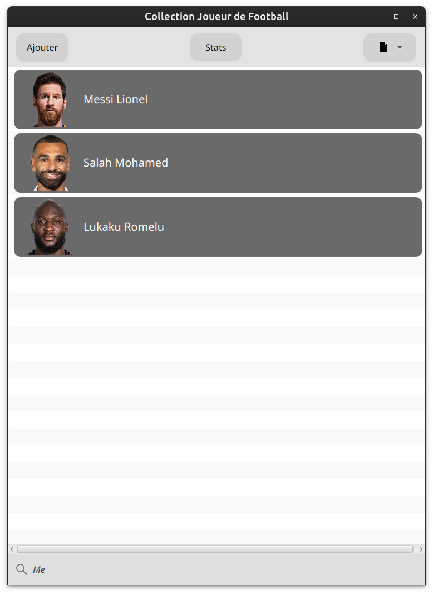
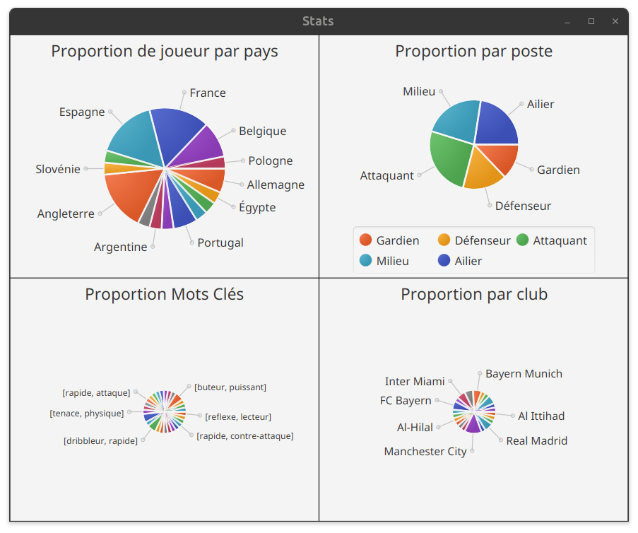

# CollectionJoueurs
Projet universitaire JavaFX permettant de gérer une collection de joueurs de football avec affichage graphique, navigation entre vues et import/export des données.

## Présentation
> L’application propose une interface JavaFX permettant d’afficher une liste de joueurs, de consulter leurs fiches détaillées et de gérer les données via des fichiers JSON ou CSV. Chaque joueur possède des informations descriptives ainsi qu’une image affichée dans l’interface.

## Fonctionnalités
- Affichage graphique des joueurs via JavaFX
- Navigation entre une vue globale et une vue détaillée
- Mise à jour dynamique des images et des informations
- Chargement des données depuis un fichier JSON ou CSV
- Export des données modifiées en JSON ou CSV
- Gestion d’une collection complète : ajout, suppression, parcours
- Architecture MVC simplifiée pour organiser le code

## Technologies
- Java 17
- JavaFX
- JSON (via Gson)
- CSV (via parsing manuel)
- IntelliJ IDEA

## Vues 
  
    
